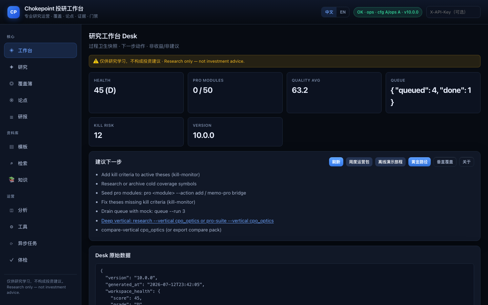
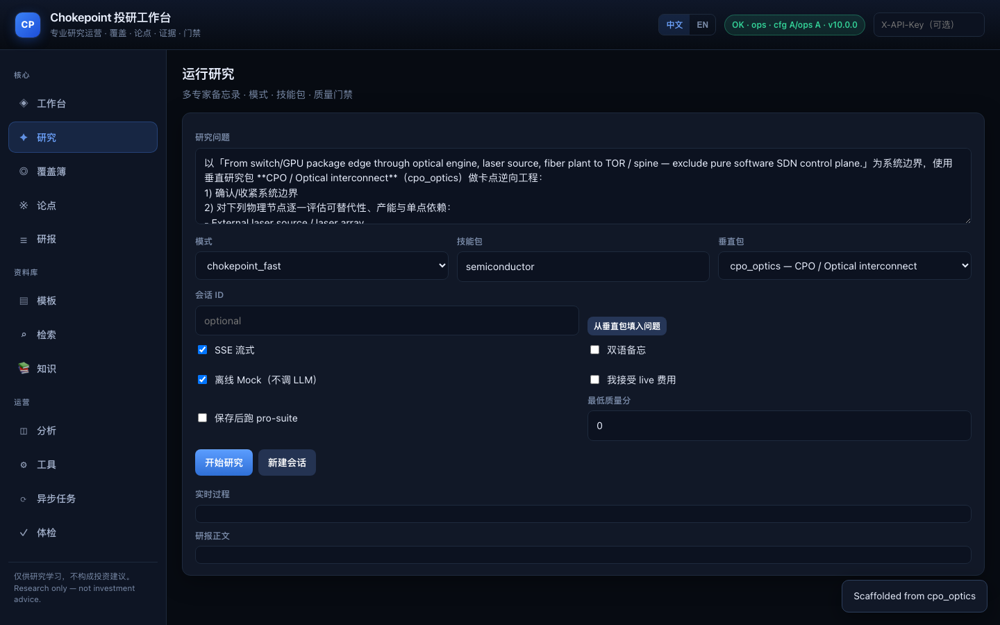
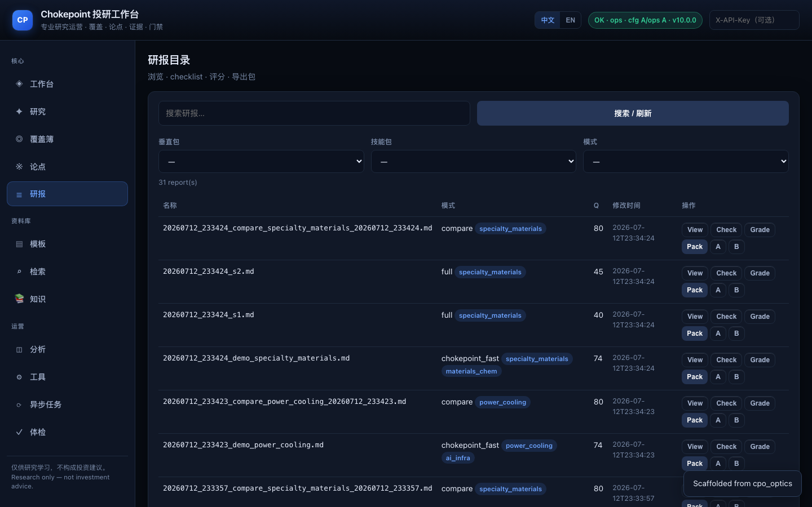
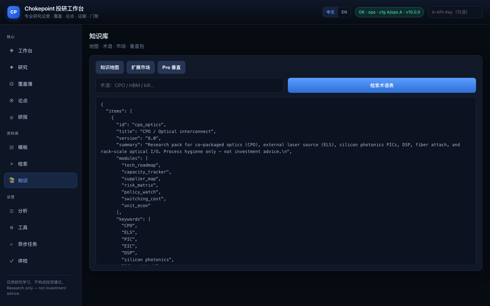

# Chokepoint 卡脖子投研工作台

[](https://github.com/BruceLanLan/chokepoint-research-agent/actions/workflows/ci.yml)
[](LICENSE)
[](https://www.python.org/downloads/)
[](https://github.com/BruceLanLan/chokepoint-research-agent/releases)

**开源专业研究运营（Research Ops）工作台**——把 **卡脖子理论（Chokepoint Theory）** 工程化为：多专家备忘录、覆盖簿 / 论点库 / 证据账本、质检门禁、垂直包对比与黄金路径。

> **在这个系统里，谁是那个沉默的、不可替代的物理开关？**

| | |
|---|---|
| **当前封版** | **v10.0.1**（工作台 1.0 里程碑，文档冻结） |
| **运行环境** | Python ≥ 3.11 |
| **许可证** | MIT |
| **English** | [README.en.md](README.en.md) |
| **完整中文索引** | [docs/zh/README.md](docs/zh/README.md) |

⚠️ **[免责声明](DISCLAIMER.md)：仅供研究与学习，不构成任何投资建议。**  
不做券商对接、不下单、不提供「买卖点」产品形态。

<p align="center">
  
</p>
<p align="center"><em>图：研究 Desk — 过程卫生快照与下一步动作（非收益 / 非建议）</em></p>

---

## 为什么做这个？

市面上多数「AI 炒股机器人」优化的是 **聊天叙事**：Capex、EPS、股价故事。

本项目做的是 **研究运营栈**：更像纪律型供应链分析师的工作方式——先拆可触摸系统，再写可证伪的杀逻辑，最后把备忘录、证据、覆盖状态落成可审计文件。

| 维度 | 常见聊天 Bot | **本项目** |
|------|--------------|------------|
| 问题 | 「某某股票会超预期吗？」 | 「哪个物理节点断了，系统会瘫痪？」 |
| 方法 | 自上而下叙事 | **自下而上**拆解 |
| 产出 | 无结构闲聊 | **可落盘研报** + Scorecard + kill criteria |
| 过程 | 单模型独白 | 多专家 + **红蓝对抗** |
| 运营 | 无 | 覆盖 · 论点 · 证据 · 队列 · 周度卫生 |
| 费用 | 常默认烧 token | **离线优先**，live 需显式门禁 |

**一句话定位**

> 开源、框架优先的投研 Agent：把卡脖子方法论做成多专家研究 + 工作台原语，而不是行情终端或券商。

---

## 界面一览

### 研究 Desk



- 工作区健康分、Pro 模块、质量均值、队列与 Kill 风险  
- **黄金路径** / 演示旅程 / 垂直覆盖一键入口  
- 中英界面切换  

### 运行研究



- 多模式：`full` / `chokepoint_fast` / `risk_only` / `compare`  
- **垂直包**（CPO / HBM / 供电散热 / 执行器 / 材料）一键脚手架  
- 默认 **Mock 离线**（不烧 LLM）；live 须勾选「接受费用」  

### 研报目录与对比



- 按 `vertical_id` / skill / mode 筛选  
- 两份备忘 **相似度 · 质量差 · Scorecard 节点差**  
- 导出对比包（Markdown + JSON）  

### 知识与垂直包



- 知识地图 · 术语表 · Marketplace · Pro 垂直包  

启动 UI：

```bash
python main.py --server
# 浏览器打开 http://127.0.0.1:8000/
```

快捷键（焦点不在输入框时）：`Alt+D` Desk · `Alt+R` 研究 · `Alt+W` 覆盖 · `Alt+T` 论点 · `Alt+P` 研报 · `Alt+O` 工具  

---

## 目录

1. [适合谁 / 不适合谁](#1-适合谁--不适合谁)  
2. [方法论](#2-方法论)  
3. [能力全景](#3-能力全景)  
4. [架构](#4-架构)  
5. [快速开始](#5-快速开始)  
6. [推荐工作流](#6-推荐工作流)  
7. [命令行精华](#7-命令行精华)  
8. [API 精华](#8-api-精华)  
9. [配置与费用门禁](#9-配置与费用门禁)  
10. [项目结构](#10-项目结构)  
11. [文档索引](#11-文档索引)  
12. [开发与测试](#12-开发与测试)  
13. [版本与封版](#13-版本与封版)  
14. [安全 · 贡献 · 许可](#14-安全--贡献--许可)  

---

## 1. 适合谁 / 不适合谁

**适合**

- 做 **AI 基建 / 半导体 / 光互联 / 机器人 / 材料** 研究笔记的人  
- 需要 **可复现研报**（文件、标签、谱系、导出）的小团队  
- 想把「卡脖子」框架产品化的开发者  
- 习惯 **CLI + API + 轻量 Web UI** 的用户  

**不适合**

- 自动下单、信号跟单、当投顾用  
- 期望「替代 Bloomberg 数据终端」  
- 不愿自备模型 / 搜索 Key，又希望默认 live 联网研究  

---

## 2. 方法论

完整说明：[docs/zh/methodology.md](docs/zh/methodology.md) · [docs/methodology.md](docs/methodology.md)

从**可触摸系统**出发（如 GPU 光互连、供电链路、机器人关节），逐层下拆：

```text
系统 → 模块 → 关键器件 → 设备 → 材料 → 地理 / 政策
```

启发式五维（1–5）：**不可替代性 · 集中度 · 下游杠杆 · 覆盖真空 · 商业化拐点**。

**不可妥协原则**

1. 研究 ≠ 建议  
2. 数字要有来源  
3. 发布前红蓝对抗（kill criteria）  
4. 研报可审计（frontmatter 元数据）  
5. 离线默认可跑，live 显式门禁  

浓缩笔记：[`knowledge/chokepoint_theory_bruceblue.md`](knowledge/chokepoint_theory_bruceblue.md)  
知识地图：[`knowledge/maps/`](knowledge/maps/) · 术语：[`knowledge/glossary/`](knowledge/glossary/)

---

## 3. 能力全景

### 多专家研究

| 模式 | 用途 |
|------|------|
| `full` | 完整多专家备忘 |
| `chokepoint_fast` | 低成本卡点快扫 |
| `risk_only` | 红蓝 / 杀逻辑 |
| `compare` | 2–4 标的对照 |

- 技能包（`skills/packs`）与 **5 个深垂直包**（`skills/pro_verticals`：CPO / HBM / 供电散热 / 执行器 / 特种材料）  
- 后处理：结构质检、Scorecard 图、证据抽取、可选 pro-suite  

### 研究运营

| 能力 | 入口 | 作用 |
|------|------|------|
| 体检 / Desk | `doctor` · `desk` · UI Desk | 环境与过程卫生 |
| 黄金路径 | `golden-path` | 离线一键仪式 |
| 覆盖簿 | `watch` | 标的与笔记 |
| 论点库 | `thesis` · `kill-monitor` | 状态与杀逻辑 |
| 垂直覆盖 | `vertical-coverage` | 各包 memo / 成对情况 |
| 对比 | `compare-vertical` | 同 vertical 两份备忘差异 |
| 队列 | `queue`（默认 mock） | 规划批量研究 |
| 周度 | `weekly-ops` | 卫生包 + 垂直覆盖段 |
| 50 Pro 模块 | `pro` · `pro-suite` | 过程模块火车 |

### 数据与扩展

- SEC / A 股公告 / 港股取向 / Yahoo 行情（尽力而为，非监管级）  
- 插件目录 `./plugins/` · [PLUGIN_SDK](docs/zh/PLUGIN_SDK.md)  
- 鉴权：API Key / Bearer / OIDC  

---

## 4. 架构

```text
用户 ── CLI / FastAPI / Web UI
          │
          ├── 研究 Agent（模式 + 技能 + 垂直包 + 后处理）
          ├── 研究运营（覆盖 / 论点 / 队列 / 证据 / desk / pro / 对比）
          └── 数据提供方（SEC · A股 · HK · 行情 · 插件）
          │
          ▼
     reports/ · data/ · 导出物
```

```text
问题 → 总监规划 → 专家并行 → 风险红队 → Markdown 研报 → 质检 → 归档
```

详见：[docs/zh/architecture.md](docs/zh/architecture.md) · [docs/PROFESSIONAL_WORKSTATION.md](docs/PROFESSIONAL_WORKSTATION.md)

---

## 5. 快速开始

### 环境

- Python **≥ 3.11**  
- （可选 live）模型 API + Tavily 等搜索 Key  

### 安装

```bash
git clone https://github.com/BruceLanLan/chokepoint-research-agent.git
cd chokepoint-research-agent

python3.11 -m venv .venv
source .venv/bin/activate   # Windows: .venv\Scripts\activate
pip install -U pip && pip install -r requirements.txt

cp .env.example .env
# 仅做离线运营可不填 Key；live 研究再补模型与 TAVILY
```

### 30 秒离线体验（推荐）

```bash
python main.py doctor --ops-only
python main.py golden-path -V cpo_optics
python main.py vertical-coverage
python main.py compare-vertical cpo_optics --export
python main.py --server
```

### 第一次 live 研究（耗 token）

```bash
# 需配置模型 Key；须显式接受费用
python main.py research "拆解 AI GPU 机柜 CPO 卡点" \
  --mode chokepoint_fast \
  --vertical cpo_optics \
  --skill semiconductor \
  --i-accept-live-costs \
  --min-quality 50 \
  --export
```

未接受费用且非 mock 时，API 返回 **402**，UI 也会拦截。

---

## 6. 推荐工作流

```text
定界 → 选垂直包 → 覆盖/论点 → 研究(mock 或 live) → 证据/门禁 → 对比归档 → 周度卫生
```

**周度仪式（离线）**

```bash
python main.py golden-path -V cpo_optics
python main.py weekly-ops
python main.py desk --md
```

示例问题：[`examples/sample_questions.md`](examples/sample_questions.md)

---

## 7. 命令行精华

```bash
# 黄金路径 / 运营
python main.py doctor · desk · golden-path -V cpo_optics
python main.py vertical-coverage · weekly-ops · demo-journey

# 研究（离线 mock）
python main.py research --mock -V cpo_optics
python main.py research --mock --template vertical_coverage --var vertical_id=cpo_optics --var system="AI 光互连" --var context=""

# 对比
python main.py compare-vertical cpo_optics --list
python main.py compare-vertical cpo_optics --export
python main.py compare-vertical --a older.md --b newer.md --thesis-id <id>

# 覆盖 / 论点
python main.py watch add NVDA --priority high
python main.py thesis add --title "…" --statement "…" --kills "…"

# Pro
python main.py pro · pro-suite --vertical cpo_optics · pro-dashboard
```

完整帮助：`python main.py --help` · 中文 CLI 说明：[docs/zh/cli.md](docs/zh/cli.md)

---

## 8. API 精华

| 区域 | 路径 |
|------|------|
| UI / 健康 | `GET /` · `GET /health` · `GET /about` · `GET /capabilities` |
| 研究 | `POST /research`（`mock` / `vertical` / `i_accept_live_costs`）· `POST /research/stream` |
| 黄金路径 | `POST /golden-path` · `POST /demo-journey` |
| 目录 | `GET /reports?vertical_id=` · `GET /reports/facets` |
| 对比 | `GET/POST /reports/compare` · `POST /reports/compare/export` |
| 垂直 | `GET /pro/verticals` · `GET /verticals/coverage` |

OpenAPI：`http://127.0.0.1:8000/docs`  
Live / UI 冒烟说明：[docs/LIVE_AND_UI_SMOKE.md](docs/LIVE_AND_UI_SMOKE.md)

---

## 9. 配置与费用门禁

| 变量 | 含义 |
|------|------|
| `MODEL_PROVIDER` / `MODEL_NAME` / API Key | 模型 |
| `TAVILY_API_KEY` | 联网搜索（缺省时 soft-fail，不拖垮离线运营） |
| `API_ACCESS_KEY` 等 | API 鉴权 |
| `CHOKEPOINT_I_ACCEPT_LIVE_COSTS=1` | 允许 live 队列/研究 |
| `CHOKEPOINT_RUN_LIVE_TESTS=1` | 允许 live 集成测试脚本 |
| `CHOKEPOINT_UI_BROWSER=1` | 可选 Playwright 浏览器冒烟 |

脱敏查看：`python main.py config-show`  
**切勿提交 `.env`。**

---

## 10. 项目结构

```text
chokepoint-research-agent/
├── main.py                 # CLI 入口 → src/cli
├── src/
│   ├── api/                # FastAPI 路由包
│   ├── cli/                # Typer 命令包
│   ├── static/             # 专业 Web UI
│   ├── ops/                # 研究运营（desk / queue / 对比 / 覆盖…）
│   ├── agents/ · pipeline/ · tools/ · providers/
│   └── …
├── skills/pro/             # 50 Pro YAML 规格
├── skills/pro_verticals/   # 5 个深垂直包
├── knowledge/              # 地图 · 术语 · 方法论笔记
├── docs/                   # 文档 · 截图 docs/images/
├── tests/ · scripts/ · templates/
└── reports/ · data/        # 运行时产出（内容通常 gitignore）
```

---

## 11. 文档索引

| 文档 | 说明 |
|------|------|
| [docs/FREEZE.md](docs/FREEZE.md) | **当前封版说明** |
| [docs/RELEASE_NOTES_10.0.md](docs/RELEASE_NOTES_10.0.md) | 10.0 里程碑发布说明 |
| [docs/PROFESSIONAL_WORKSTATION.md](docs/PROFESSIONAL_WORKSTATION.md) | 分析师闭环 |
| [docs/zh/methodology.md](docs/zh/methodology.md) | 方法论 |
| [docs/zh/architecture.md](docs/zh/architecture.md) | 架构 |
| [docs/LIVE_AND_UI_SMOKE.md](docs/LIVE_AND_UI_SMOKE.md) | Live 门禁与 UI 冒烟 |
| [docs/PROVIDERS.md](docs/PROVIDERS.md) | 数据提供方边界 |
| [docs/zh/README.md](docs/zh/README.md) | 中文文档中心 |
| [README.en.md](README.en.md) | English README |
| [CHANGELOG.md](CHANGELOG.md) | 变更历史 |
| [DISCLAIMER.md](DISCLAIMER.md) · [SECURITY.md](SECURITY.md) | 法律与安全 |

重新截图（可选）：

```bash
pip install playwright && playwright install chromium
python scripts/capture_readme_screenshots.py
```

---

## 12. 开发与测试

```bash
make check                 # smoke + ui-smoke + pytest + eval
pytest -q -m "not live and not browser"
python scripts/ui_smoke.py
python main.py eval
```

当前离线测试约 **167** 通过；live / browser 默认跳过。

---

## 13. 版本与封版

| 版本 | 说明 |
|------|------|
| **v10.0.x** | **工作台 1.0 里程碑 · 文档封版** |
| v8.x–v9.x | 垂直包、对比、门禁、黄金路径列车 |
| 更早 | 多专家核心与 50 Pro 模块火车 |

封版策略与范围见 **[docs/FREEZE.md](docs/FREEZE.md)**。  
路线图：[docs/ROADMAP.md](docs/ROADMAP.md) · [docs/zh/ROADMAP.md](docs/zh/ROADMAP.md)

---

## 14. 安全 · 贡献 · 许可

- 安全： [SECURITY.md](SECURITY.md)  
- 贡献：欢迎 Issue / PR；请保持 **mock 默认、密钥不入库、研究免责声明**  
- 许可： [MIT](LICENSE)  

---

**再次声明：本项目仅供研究学习，不构成投资建议，也不保证任何数据或模型输出的正确性与完整性。**
