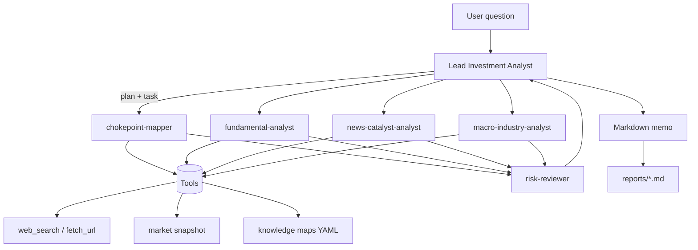

# Architecture

## Overview



```text
                    ┌─────────────────────────┐
  User question ──► │  Lead Investment Analyst │
                    │  (plan + synthesize)     │
                    └───────────┬─────────────┘
                                │ task() / parallel
          ┌─────────────────────┼─────────────────────┐
          ▼                     ▼                     ▼
   chokepoint-mapper    fundamental-analyst   news-catalyst
   (supply chain map)   (financials/valuat.)  (events/sentiment)
          │                     │                     │
          └──────────┬──────────┴──────────┬──────────┘
                     ▼                     ▼
              macro-industry         risk-reviewer
              (policy/geo)           (devil's advocate)
                     │                     │
                     └──────────┬──────────┘
                                ▼
                     Final research memo (Markdown)
                                │
                                ▼
                          reports/*.md
```

## Design principles

1. **Framework over tickers** — Chokepoint Theory is methodology DNA, not a hard-coded buy list.
2. **Tools own facts** — Prices, filings, and news must come from tools when possible; the model must not invent numbers.
3. **Fresh-context risk** — Risk review is a separate specialist (adversarial), inspired by long-horizon agent verification loops.
4. **Two runtimes** — Prefer LangChain `deepagents.create_deep_agent`; fall back to the built-in parallel orchestrator.

## Runtime paths

| Path | When | Entry |
|------|------|--------|
| Deep Agents | Python ≥ 3.11 + `deepagents` installed | `src/agents/research_agent.py` |
| Fallback | Import/API failure | `src/agents/fallback_orchestrator.py` |
| CLI | Local research | `main.py` (Typer) |
| HTTP | Productization | `src/api.py` FastAPI |

## Components

| Path | Role |
|------|------|
| `src/prompts/investment.py` | System prompts + Chokepoint method block |
| `src/tools/research_tools.py` | Search, fetch, market snapshot, save report |
| `src/tools/knowledge.py` | Local YAML supply-chain sketches |
| `src/agents/model.py` | Anthropic / OpenAI-compatible / EdgeOne gateway |
| `src/config.py` | Env-based settings (`pydantic-settings`) |
| `knowledge/` | Human-readable methodology notes |
| `knowledge/maps/` | Editable supply-chain sketch maps (YAML) |

## Specialist contracts

| Agent | Must answer |
|-------|-------------|
| chokepoint-mapper | System tree + Scorecard + path dependency |
| fundamental-analyst | Business model, financials, liquidity, coverage vacuum |
| news-catalyst-analyst | Timeline, catalysts, narrative gap |
| macro-industry-analyst | Policy / geo / Capex transmission to nodes |
| risk-reviewer | Strongest bears + kill criteria |

## Report contract

Every full memo should include:

1. One-page thesis  
2. System deconstruction / physical switch  
3. Business & fundamentals  
4. Catalysts  
5. Macro / policy  
6. Red-team risks + kill criteria  
7. Sources  

See prompts for the authoritative template.

## Deployment options

1. **Local CLI** — fastest for power users  
2. **FastAPI** — `python main.py --server` behind your reverse proxy  
3. **EdgeOne Makers** — port prompts into the Deep Agents research template  

Details: [deployment.md](./deployment.md)
